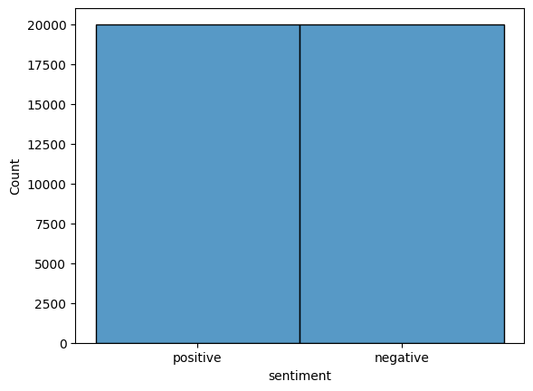
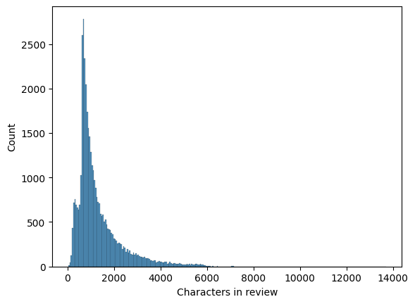
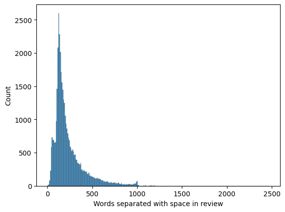
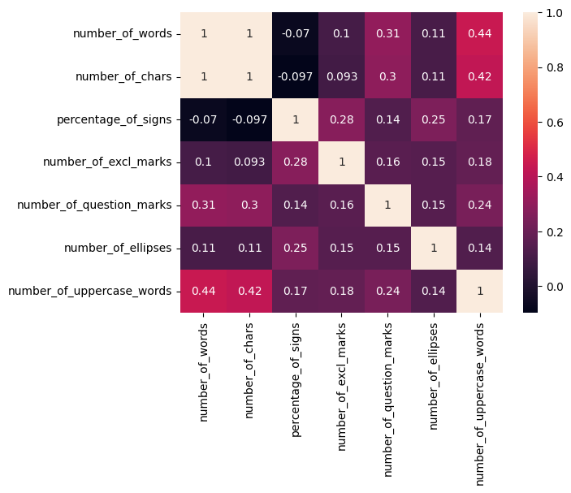
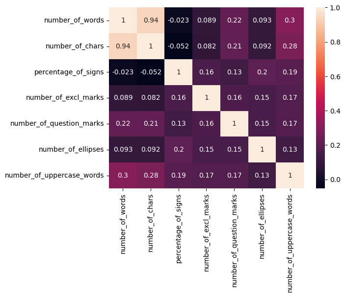
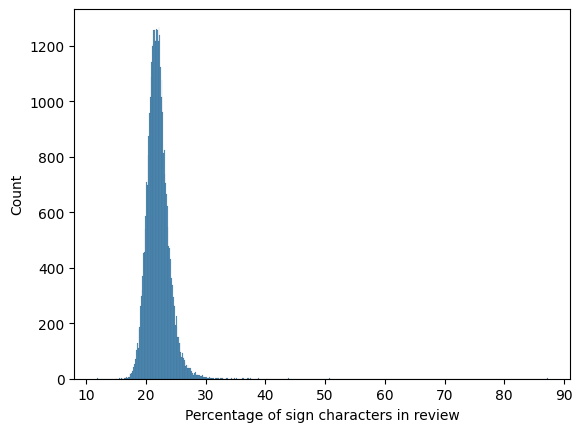
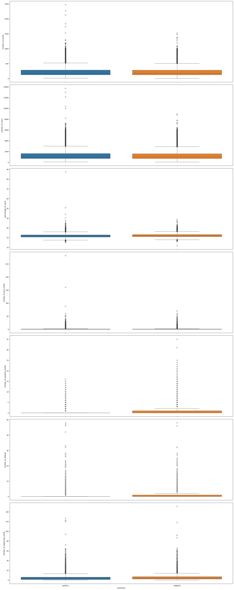
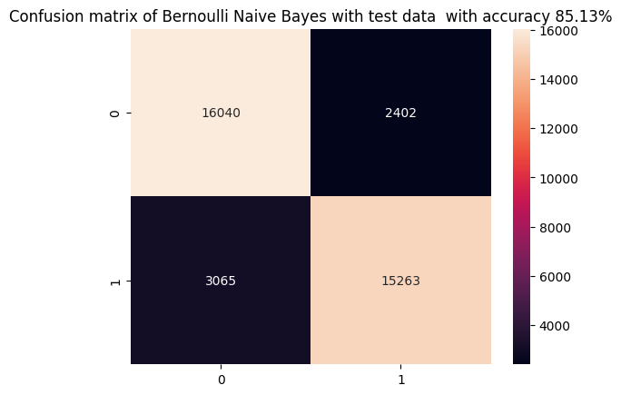
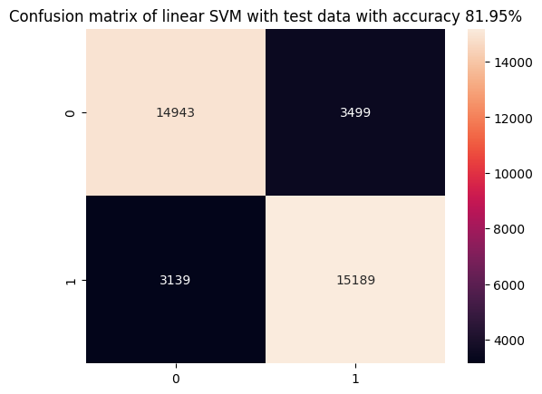
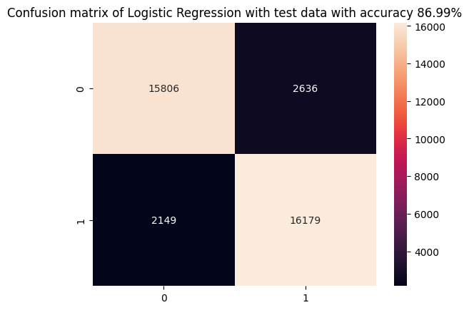

# Data Science Final Project.

## Table of Contents.

## Task Overview.

### Assignment.
Build a model for binary (positive / negative) sentiment analysis of movies text reviews. Two datasets `train.csv` and `test.csv` were given for model's training and evaluation respectively.

### Code overview.

Initial data analysis and experiments were done in the notebooks (`./notebooks/` folder):
- `EDA.ipynb`
- `data_preprocessing.ipynb`
- `models_training_and_evaluation.ipynb`

`./src` folder contains two main folders for building and executing Docker containers for models training (`./src/train/train.py`) and evaluation (`./src/inference/run_interference.py`).
Following supporting scripts are created:
- `config_loading.py`: loads necessary sources for initial datasets and defines directories for future models, predictions, and metrics storage from `sources.cfg`.
- `data_loading.py`: loads and unpacks raw data.
- `data_preprocessing.py`: set of util functions used for text preprocessing (including features creation, tokenization, lemmatization & stemming, vectorization, etc.)

In `./outputs/predictions/` folder for each of three considered models metrics and predicted datasets are stored.

### Pipeline Execution.

TOTO

## Exploratory Data Analysis.

### General dataset characteristics.

- 40'000 rows in training dataset in total. There are 272 duplicated rows and 266 duplicated reviews in total.
<div>
<style scoped>
    .dataframe tbody tr th:only-of-type {
        vertical-align: middle;
    }

    .dataframe tbody tr th {
        vertical-align: top;
    }

    .dataframe thead th {
        text-align: right;
    }
</style>
<table border="0" class="dataframe">
  <thead>
    <tr style="text-align: right;">
      <th></th>
      <th>count</th>
      <th>unique</th>
      <th>top</th>
      <th>freq</th>
    </tr>
  </thead>
  <tbody>
    <tr>
      <th>review</th>
      <td>40000</td>
      <td>39728</td>
      <td>Loved today's show!!! It was a variety and not...</td>
      <td>5</td>
    </tr>
    <tr>
      <th>sentiment</th>
      <td>40000</td>
      <td>2</td>
      <td>positive</td>
      <td>20000</td>
    </tr>
  </tbody>
</table>
</div>

- There are no `null` or empty string values in both `review` and `sentiment` columns.

- There are no same reviews with different sentimental, therefore no logical inconsistency persists in train dataset.  

- There are equal amount of positive and negative sentiments (20'000 rows for both).


### Feature Engineering and Text Analysis.

The following numerical features of reviews were investigated: 
```
'number_of_words'
'number_of_chars'
'percentage_of_signs'
'number_of_excl_marks'
'number_of_question_marks'
'number_of_ellipses'
'number_of_uppercase_words'
```
<div>
<style scoped>
    .dataframe tbody tr th:only-of-type {
        vertical-align: middle;
    }

    .dataframe tbody tr th {
        vertical-align: top;
    }

    .dataframe thead th {
        text-align: right;
    }
</style>
<table border="0" class="dataframe">
  <thead>
    <tr style="text-align: right;">
      <th></th>
      <th>count</th>
      <th>mean</th>
      <th>std</th>
      <th>min</th>
      <th>25%</th>
      <th>50%</th>
      <th>75%</th>
      <th>max</th>
    </tr>
  </thead>
  <tbody>
    <tr>
      <th>number_of_words</th>
      <td>40000.0</td>
      <td>231.362750</td>
      <td>171.083908</td>
      <td>4.000000</td>
      <td>126.000000</td>
      <td>173.00000</td>
      <td>282.000000</td>
      <td>2470.000000</td>
    </tr>
    <tr>
      <th>number_of_chars</th>
      <td>40000.0</td>
      <td>1310.549450</td>
      <td>987.955229</td>
      <td>41.000000</td>
      <td>699.000000</td>
      <td>971.00000</td>
      <td>1595.000000</td>
      <td>13704.000000</td>
    </tr>
    <tr>
      <th>percentage_of_signs</th>
      <td>40000.0</td>
      <td>21.977625</td>
      <td>1.825969</td>
      <td>11.764706</td>
      <td>20.805369</td>
      <td>21.83136</td>
      <td>22.940277</td>
      <td>87.311178</td>
    </tr>
    <tr>
      <th>number_of_excl_marks</th>
      <td>40000.0</td>
      <td>0.971950</td>
      <td>2.957310</td>
      <td>0.000000</td>
      <td>0.000000</td>
      <td>0.00000</td>
      <td>1.000000</td>
      <td>282.000000</td>
    </tr>
    <tr>
      <th>number_of_question_marks</th>
      <td>40000.0</td>
      <td>0.645175</td>
      <td>1.495052</td>
      <td>0.000000</td>
      <td>0.000000</td>
      <td>0.00000</td>
      <td>1.000000</td>
      <td>35.000000</td>
    </tr>
    <tr>
      <th>number_of_ellipses</th>
      <td>40000.0</td>
      <td>0.499400</td>
      <td>1.580463</td>
      <td>0.000000</td>
      <td>0.000000</td>
      <td>0.00000</td>
      <td>0.000000</td>
      <td>48.000000</td>
    </tr>
    <tr>
      <th>number_of_uppercase_words</th>
      <td>40000.0</td>
      <td>4.878900</td>
      <td>5.585357</td>
      <td>0.000000</td>
      <td>1.000000</td>
      <td>3.00000</td>
      <td>6.000000</td>
      <td>151.000000</td>
    </tr>
  </tbody>
</table>
</div>

- Length of characters / words in review are skewed left. Mean number of words in review is 231 and mean number of chars -- 1310. While maximum number of chars is more than 13'000. Maximum number of words is 2'500.

 

- There is no high correlation between them (considering Pearson, Kendall and Spearman correlation coefficients), except obvious dependency between number of words and characters.

   

- Average ratio of non-alphabetical chars in review is 21% (which is pretty high). Since in texts appears fragments `<br />`, `blablablabla+`, ` >>>>>>> `, `*[word]*`, `........`, `?[word]?`, `[word]-[word]-[word]` and other noise, therefore number of particular characters / marks were kept as numerical features, and all other non-alphabetical signs were removed during text preprocessing.


- Were obtained, that `number_of_ellipses` and `number_of_question_marks` are higher for negative sentiments. For other `numerical_review_features` box-plots showed no significant difference in distributions between positive and negative sentiments.

<div>
<style scoped>
    .dataframe tbody tr th:only-of-type {
        vertical-align: middle;
    }

    .dataframe tbody tr th {
        vertical-align: top;
    }

    .dataframe thead th {
        text-align: right;
    }
</style>
<table border="0" class="dataframe">
  <thead>
    <tr style="text-align: right;">
      <th></th>
      <th>sentiment</th>
      <th>negative</th>
      <th>positive</th>
    </tr>
  </thead>
  <tbody>
    <tr>
      <th rowspan="8" valign="top">number_of_words</th>
      <th>count</th>
      <td>20000.000000</td>
      <td>20000.000000</td>
    </tr>
    <tr>
      <th>mean</th>
      <td>230.186850</td>
      <td>232.538650</td>
    </tr>
    <tr>
      <th>std</th>
      <td>165.642483</td>
      <td>176.353828</td>
    </tr>
    <tr>
      <th>min</th>
      <td>4.000000</td>
      <td>10.000000</td>
    </tr>
    <tr>
      <th>25%</th>
      <td>128.000000</td>
      <td>125.000000</td>
    </tr>
    <tr>
      <th>50%</th>
      <td>174.000000</td>
      <td>172.000000</td>
    </tr>
    <tr>
      <th>75%</th>
      <td>280.000000</td>
      <td>284.000000</td>
    </tr>
    <tr>
      <th>max</th>
      <td>1522.000000</td>
      <td>2470.000000</td>
    </tr>
    <tr>
      <th rowspan="8" valign="top">number_of_chars</th>
      <th>count</th>
      <td>20000.000000</td>
      <td>20000.000000</td>
    </tr>
    <tr>
      <th>mean</th>
      <td>1298.143300</td>
      <td>1322.955600</td>
    </tr>
    <tr>
      <th>std</th>
      <td>950.224379</td>
      <td>1024.170719</td>
    </tr>
    <tr>
      <th>min</th>
      <td>41.000000</td>
      <td>65.000000</td>
    </tr>
    <tr>
      <th>25%</th>
      <td>705.000000</td>
      <td>692.000000</td>
    </tr>
    <tr>
      <th>50%</th>
      <td>974.000000</td>
      <td>968.000000</td>
    </tr>
    <tr>
      <th>75%</th>
      <td>1576.000000</td>
      <td>1614.000000</td>
    </tr>
    <tr>
      <th>max</th>
      <td>8969.000000</td>
      <td>13704.000000</td>
    </tr>
    <tr>
      <th rowspan="8" valign="top">percentage_of_signs</th>
      <th>count</th>
      <td>20000.000000</td>
      <td>20000.000000</td>
    </tr>
    <tr>
      <th>mean</th>
      <td>22.163721</td>
      <td>21.791530</td>
    </tr>
    <tr>
      <th>std</th>
      <td>1.776076</td>
      <td>1.856013</td>
    </tr>
    <tr>
      <th>min</th>
      <td>11.764706</td>
      <td>14.925373</td>
    </tr>
    <tr>
      <th>25%</th>
      <td>20.985011</td>
      <td>20.629241</td>
    </tr>
    <tr>
      <th>50%</th>
      <td>22.025873</td>
      <td>21.639938</td>
    </tr>
    <tr>
      <th>75%</th>
      <td>23.125000</td>
      <td>22.758413</td>
    </tr>
    <tr>
      <th>max</th>
      <td>38.847858</td>
      <td>87.311178</td>
    </tr>
    <tr>
      <th rowspan="8" valign="top">number_of_excl_marks</th>
      <th>count</th>
      <td>20000.000000</td>
      <td>20000.000000</td>
    </tr>
    <tr>
      <th>mean</th>
      <td>1.009400</td>
      <td>0.934500</td>
    </tr>
    <tr>
      <th>std</th>
      <td>2.540263</td>
      <td>3.322057</td>
    </tr>
    <tr>
      <th>min</th>
      <td>0.000000</td>
      <td>0.000000</td>
    </tr>
    <tr>
      <th>25%</th>
      <td>0.000000</td>
      <td>0.000000</td>
    </tr>
    <tr>
      <th>50%</th>
      <td>0.000000</td>
      <td>0.000000</td>
    </tr>
    <tr>
      <th>75%</th>
      <td>1.000000</td>
      <td>1.000000</td>
    </tr>
    <tr>
      <th>max</th>
      <td>70.000000</td>
      <td>282.000000</td>
    </tr>
    <tr>
      <th rowspan="8" valign="top">number_of_question_marks</th>
      <th>count</th>
      <td>20000.000000</td>
      <td>20000.000000</td>
    </tr>
    <tr>
      <th>mean</th>
      <td>0.905000</td>
      <td>0.385350</td>
    </tr>
    <tr>
      <th>std</th>
      <td>1.825881</td>
      <td>1.000802</td>
    </tr>
    <tr>
      <th>min</th>
      <td>0.000000</td>
      <td>0.000000</td>
    </tr>
    <tr>
      <th>25%</th>
      <td>0.000000</td>
      <td>0.000000</td>
    </tr>
    <tr>
      <th>50%</th>
      <td>0.000000</td>
      <td>0.000000</td>
    </tr>
    <tr>
      <th>75%</th>
      <td>1.000000</td>
      <td>0.000000</td>
    </tr>
    <tr>
      <th>max</th>
      <td>35.000000</td>
      <td>16.000000</td>
    </tr>
    <tr>
      <th rowspan="8" valign="top">number_of_ellipses</th>
      <th>count</th>
      <td>20000.000000</td>
      <td>20000.000000</td>
    </tr>
    <tr>
      <th>mean</th>
      <td>0.599500</td>
      <td>0.399300</td>
    </tr>
    <tr>
      <th>std</th>
      <td>1.664343</td>
      <td>1.485183</td>
    </tr>
    <tr>
      <th>min</th>
      <td>0.000000</td>
      <td>0.000000</td>
    </tr>
    <tr>
      <th>25%</th>
      <td>0.000000</td>
      <td>0.000000</td>
    </tr>
    <tr>
      <th>50%</th>
      <td>0.000000</td>
      <td>0.000000</td>
    </tr>
    <tr>
      <th>75%</th>
      <td>1.000000</td>
      <td>0.000000</td>
    </tr>
    <tr>
      <th>max</th>
      <td>48.000000</td>
      <td>48.000000</td>
    </tr>
    <tr>
      <th rowspan="8" valign="top">number_of_uppercase_words</th>
      <th>count</th>
      <td>20000.000000</td>
      <td>20000.000000</td>
    </tr>
    <tr>
      <th>mean</th>
      <td>5.171500</td>
      <td>4.586300</td>
    </tr>
    <tr>
      <th>std</th>
      <td>5.608267</td>
      <td>5.547079</td>
    </tr>
    <tr>
      <th>min</th>
      <td>0.000000</td>
      <td>0.000000</td>
    </tr>
    <tr>
      <th>25%</th>
      <td>2.000000</td>
      <td>1.000000</td>
    </tr>
    <tr>
      <th>50%</th>
      <td>4.000000</td>
      <td>3.000000</td>
    </tr>
    <tr>
      <th>75%</th>
      <td>7.000000</td>
      <td>6.000000</td>
    </tr>
    <tr>
      <th>max</th>
      <td>151.000000</td>
      <td>126.000000</td>
    </tr>
  </tbody>
</table>
</div> 




## Text Preprocessing.

### Actions Preformed.

#### Removal of noise and non-alphabetical characters.

1. Removal of reviews-outliers, which length is not inside IRQ. Total number of outliers is 2958, and number of reviews left for models training 36770.
2. Removal of HTML-tags (`<br />`).
3. Removal of punctuation `string.punctuation`.
4. Removal of `nltk.corpus.stopwords.words('english')`.
5. Removal of all digits.
6. Removal of emojis and non-printable characters (all characters left are in `string.printable`).

#### Text tokenization.

Text tokenization was preformed with `nltk.tokenize.word_tokenize`.

#### Lemmatization.

In computational linguistics, lemmatization is the algorithmic process of determining the lemma of a word based on its intended meaning. Unlike stemming, lemmatization depends on correctly identifying the intended part of speech and meaning of a word in a sentence, as well as within the larger context surrounding that sentence, such as neighbouring sentences or even an entire document.

```python
def lemmatize_words(
    text: list
):
    import nltk
    from nltk.corpus import wordnet
    from nltk.stem import WordNetLemmatizer

    nltk.download('wordnet')
    nltk.download('averaged_perceptron_tagger_eng')
    
    lemmatizer = WordNetLemmatizer()
    wordnet_map = {
        "N": wordnet.NOUN, 
        "V": wordnet.VERB, 
        "J": wordnet.ADJ, 
        "R": wordnet.ADV
    }
    pos_tagged_text = nltk.pos_tag(text)
    return [lemmatizer.lemmatize(word, wordnet_map.get(pos[0], wordnet.NOUN)) for word, pos in pos_tagged_text]


reviews_df['lemmatized_review'] = reviews_df['tokenized_review'].parallel_apply(lemmatize_words)
```

#### Stemming. 

Stemming is the process of reducing inflected (or sometimes derived) words to their word stem, base or root form—generally a written word form. The stem need not be identical to the morphological root of the word; it is usually sufficient that related words map to the same stem, even if this stem is not in itself a valid root.

```python 
def stem_words(
    text
):
    from nltk.stem.porter import PorterStemmer
    stemmer = PorterStemmer()
    
    return [stemmer.stem(word) for word in text]


reviews_df['stemmed_review'] = reviews_df['tokenized_review'].parallel_apply(stem_words)
```

#### Lemmatization and Stemming comparison.

- Number of unique words were produced after both approaches.
```
Number of unique stemmed words: 93786
[('movi', 70630),
 ('film', 59314),
 ('one', 33908),
 ('like', 28273),
 ('good', 19876),
 ('time', 19668),
 ('watch', 19329),
 ('see', 18310),
 ('make', 18160),
 ('get', 17379)]
 
Number of unique lemmatized words: 138953
[('movie', 69502),
 ('film', 58016),
 ('one', 30981),
 ('make', 27532),
 ('see', 26538),
 ('like', 26363),
 ('get', 21789),
 ('good', 21553),
 ('time', 19026),
 ('watch', 17412)]
```

- Number of short words with length less than 3.
```
Number of stemmed words with length less than two: 534
[(11162, 'go'),
 (6299, 'im'),
 (4487, 'us'),
 (3739, 'tv'),
 (3235, 'he'),
 (2411, 'aw'),
 (1979, 'mr'),
 (1804, 'ye'),
 (1794, 'id'),
 (1746, 'oh'),
 (1372, 'ok'),
 (983, 'ad'),
 (915, 'th'),
 (857, 'dr'),
 (813, 'b'),
 (740, 'la'),
 (737, 'de'),
 (537, 'na'),
 (513, 'of'),
 (505, 'ed')]
 
Number of lemmatized words with length less than two: 931
[(16095, 'go'),
 (5953, 'Im'),
 (3878, 'do'),
 (3816, 'u'),
 (3494, 'TV'),
 (2174, 'he'),
 (1671, 'Id'),
 (1631, 'Mr'),
 (1200, 'Oh'),
 (1166, 'OK'),
 (895, 'th'),
 (851, 'US'),
 (824, 'Dr'),
 (678, 'B'),
 (522, 'na'),
 (492, 'oh'),
 (488, 'OF'),
 (464, 'Ed'),
 (427, 'Ms'),
 (424, 'II')]
```
- Due to higher number of distinct words, including shorted words, for models training stemmed reviews will be used.

### Vectorization.

For future models training and evaluation we have prepared two vectorized versions using simple Count Vectorizer and TF-IDF.

```python
def vectorize_review(
        df: pd.DataFrame,
        processed_text_col_name: str,
        train_df_len: int,
        vectorizer
):
    vectorized_data = vectorizer.fit_transform(df[processed_text_col_name])
    return train_test_split(
        vectorized_data,
        df['sentiment'],
        test_size=train_df_len,
        shuffle=False
    )
```

#### Count Vectorizer.
The count vectorizer is a customizable SciKit Learn preprocessor method. It works with any text out of the box, and applies preprocessing, tokenization and stop words removal on its own. These tasks can be customized, for example by providing a different tokenization method or stop word list. (This applies to all other preprocessors as well.) Applying the count vectorizer to raw text creates a matrix in the form of (document_id, tokens) in which the values are the token count.
```python
count_vectorizer = CountVectorizer()
count_X_train, count_X_test, count_y_train, count_y_test = vectorize_review(
    df=general_df,
    processed_text_col_name='stemmed_review',
    train_df_len=len(train_df),
    vectorizer=count_vectorizer
)
```

#### TF-IDF Vectorizer.
The Term Frequency/Inverse Document Frequency is a well-known metric in information retrieval. It encodes word frequencies in such a way as to put equal weight to common terms that occur in many documents, as well as uncommon terms only present in a few documents. This metric generalizes well over large corpora and improves finding relevant topics.
```python
tfidf_vectorizer = TfidfVectorizer()
tfidf_X_train, tfidf_X_test, tfidf_y_train, tfidf_y_test = vectorize_review(
    df=general_df,
    processed_text_col_name='stemmed_review',
    train_df_len=len(train_df),
    vectorizer=tfidf_vectorizer
)
```

## Models Training.

There were three models chosen appropriate for binary sentiment analysis: SVM with linear kernel, Logistic Regression and Bernoulli Naive Bayes. All of them were trained and evaluated for best approach choosing.
Main function for models training:
```python
def train_model(
        X_train,
        Y_train,
        classifier
):
    classifier.fit(X_train, Y_train)
    joblib.dump(classifier, f'{MODELS_DIR}{classifier.__class__.__name__}.pkl')
    return classifier
```


### Bernoulli Naive Bayes.
Bernoulli Naive Bayes is a variant of Naive Bayes that is particularly suited for binary/boolean features. The model is based on the Bayes Theorem and assumes that all features are independent given the class. In text classification, this model is typically used with binary feature vectors (rather than counts or TF-IDF features) which indicate the presence or absence of a word. For sentiment analysis, each word in the vocabulary is treated as a feature and it contributes independently to the probability that the sentiment is positive or negative.

*Advantages*:
- **Handling of Binary Data**: It works well with binary feature models which are common in text processing where presence or absence of words is a useful feature.
- **Scalability and Speed**: The independence assumption simplifies computation, making this model very efficient and scalable to large datasets.
- **Performance**: Despite its simplicity and the strong independence assumption, Bernoulli Naive Bayes can perform surprisingly well on sentiment analysis tasks, especially when the dataset is large.
```python
BNB = BernoulliNB()
bernoulli_nb = train_model(
    count_X_train,
    count_y_train,
    BNB
)
```

### SVM.
Support Vector Machine (SVM) is a powerful and versatile supervised machine learning algorithm used for classification and regression tasks. In the context of text sentiment analysis, SVM with a linear kernel is particularly useful. The linear kernel is a dot product between two instances, and it offers a straightforward linear decision boundary. The main idea behind SVM is to find the optimal hyperplane that maximally separates the classes in the feature space. For binary classification, such as positive/negative sentiment analysis, SVM focuses on constructing the hyperplane that has the largest distance to the nearest training data points of any class, which are called support vectors. This margin maximization offers robustness, especially in high-dimensional spaces.

*Advantages*:

- **Effectiveness in High-Dimensional Spaces**: SVMs are particularly effective in high-dimensional spaces, which is typical in text data due to the large vocabulary size.
- **Robustness**: The margin maximization principle helps SVMs to be robust against overfitting, especially in linearly separable cases.
- **Scalability**: With linear kernels, SVMs can scale relatively well to large text datasets.
```python
scaler = StandardScaler(with_mean=False)
scaler.fit(count_X_train)

norm_count_X_train = scaler.transform(count_X_train)
norm_count_X_test = scaler.transform(count_X_test)
norm_count_y_train = count_y_train.apply(lambda x: 1 if x == 'positive' else 0)
norm_count_y_test = count_y_test.apply(lambda x: 1 if x == 'positive' else 0)

SVM = svm.SVC(kernel='linear')
SVM = train_model(
    norm_count_X_train,
    norm_count_y_train,
    SVM
)
```

### Logistic Regression.
Logistic Regression is a statistical model that in its basic form uses a logistic function to model a binary dependent variable. In the context of sentiment analysis, the probabilities describing the possible outcomes of a single trial are modeled as a function of the predictor variables (text features). Logistic regression measures the relationship between the categorical dependent variable and one or more independent variables by estimating probabilities using a logistic function, which is an S-shaped curve that can take any real-valued number and map it into a value between 0 and 1, but never exactly at those limits.

*Advantages*:

- **Interpretability**: Unlike more complex models, logistic regression models have the advantage of being interpretable. Each feature’s weights indicate the importance and influence on the sentiment classification.
- **Efficiency**: Logistic regression is less computationally intensive than more complex algorithms, making it a relatively fast model to train.
- **Probabilistic Interpretation**: The model outputs a probability for the sentiment class, which can be a useful measure of confidence in the classification.
```python
LG = LogisticRegression()
logistic_regression = train_model(
    tfidf_X_train,
    tfidf_y_train,
    LG
)
```


## Models Evaluation.

Metrics were considered for models evaluation:
- `sklearn.metrics.accuracy_score`.
- `sklear.metrics.confusion_matrix`.
- Weighted average for precision, recall, f1-score and support (using `sklearn.metrics.classification_report`).
- Time required for model's training and evaluation.

### Bernoulli Naive Bayes.

- Accuracy score is: **85.13%**.
- CPU times: **1.53 s**.
- Wall time: **2.6 s**.
- Confusion matrix:


- Classification report:
```csv
              precision    recall  f1-score   support

    negative       0.84      0.87      0.85     18442
    positive       0.86      0.83      0.85     18328

    accuracy                           0.85     36770
   macro avg       0.85      0.85      0.85     36770
weighted avg       0.85      0.85      0.85     36770
```
### SVM.

- Accuracy score is: **81.95%**.
- CPU times: **3min 17s**.
- Wall time: **4min 1s**.
- Confusion matrix:


- Classification report:
```csv
              precision    recall  f1-score   support

           0       0.83      0.81      0.82     18442
           1       0.81      0.83      0.82     18328

    accuracy                           0.82     36770
   macro avg       0.82      0.82      0.82     36770
weighted avg       0.82      0.82      0.82     36770
```


### Logistic Regression.

- Accuracy score is: **85.69%**.
- CPU times: **2.12 s**.
- Wall time: **2.65 s**.
- Confusion matrix:


- Classification report:
```csv
              precision    recall  f1-score   support

    negative       0.88      0.86      0.87     18442
    positive       0.86      0.88      0.87     18328

    accuracy                           0.87     36770
   macro avg       0.87      0.87      0.87     36770
weighted avg       0.87      0.87      0.87     36770
```

## Conclusion.

### Performance Evaluation.

Among all evaluated models, the worst overall performance was for SVM with linear kernel. Both training and testing time was ~90 times more than for other models (additional time 
for standardization was not included).
Given accuracy is 81.95%, while Naive Bayes and Logistic Regression performance were above 85%. From two other models as a working one Logistic Regression was selected due to the following considerations:
- **Clarity in Decision-Making**: Logistic Regression provides coefficients for each feature (word or phrase in this context), indicating the strength and direction of their impact on the sentiment. This interpretability is crucial for understanding which aspects of the reviews most influence the sentiment, allowing for more informed decision-making and adjustments in strategy.
- **Threshold Adjustment**: The output of Logistic Regression is a probability, providing a nuanced view of sentiment beyond simple binary classifications. This allows for threshold tuning based on business needs, such as prioritizing precision over recall (or vice versa).
- **Quick Deployment**: Logistic Regression is generally less computationally intensive than models like SVM with non-linear kernels or deep learning models. This efficiency facilitates quicker retraining cycles and easier deployment, which is beneficial in dynamic environments where models need frequent updates.

### Business Applications.

Chosen Logistic Regression model for binary sentiment analysis of movie reviews could be used and adjusted for the following business purposes:
- **Audience Sentiment Tracking**: Understand public sentiment toward movie releases, promotional campaigns, or other media content. This can guide marketing strategies and content adjustments.
- **Recommendation Systems**: Enhance user experience on streaming platforms by recommending movies based on the sentiment of reviews they find aligning with their preferences.


